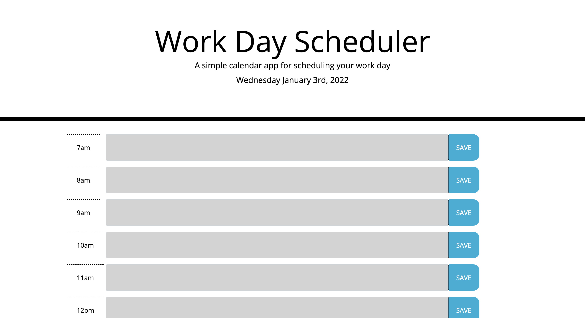

# Day Planner ✈️
* Name: Honore Nelson
* Github Repo: https://github.com/matisses-goldfish/DayPlanner
* Deployed Application: https://matisses-goldfish.github.io/DayPlanner/

## User story (reference):
```md
AS AN employee with a busy schedule
I WANT to add important events to a daily planner
SO THAT I can manage my time effectively
```

## Criteria (reference):
```md
GIVEN I am using a daily planner to create a schedule
WHEN I open the planner
THEN the current day is displayed at the top of the calendar
WHEN I scroll down
THEN I am presented with timeblocks for standard business hours
WHEN I view the timeblocks for that day
THEN each timeblock is color coded to indicate whether it is in the past, present, or future
WHEN I click into a timeblock
THEN I can enter an event
WHEN I click the save button for that timeblock
THEN the text for that event is saved in local storage
WHEN I refresh the page
THEN the saved events persist
```
## Results: 

## GOAL
The client gave clear specifications that they wanted a website that would allow users to stay orginized with work taks, via date, color cordination, and task description. Although I was provided with the basic HTML framework and the CSS, I needed to create 8-10 columns that would include the time, a text-input field, and a submit button that would store and update the users local data. 


## HTML: Framework
1. Although I was given some HTML code, I created 10 individual columns that each housed three rows. The rows included the time, a text-input feild, and a submit button. 
    * Todo this I maped out the format with pen and paper, this allowes me to understand the visual aspects of each feature in order to implement them into my code. 
2. I then went through the HTML code and matched the ID's and class provided by to css to my columns and rows in order to improve its stylized features. 
    * This also allowed me to establish IDs I could attach to my javascript varriables 
3. Once I was happy with the general layout, I moved onto my javascript. 


## Javascript: Framework:
1. Because I was not provided with any starter code for the javascript portion of the assignment, I pseudocode the general focus of the website, which was the color cordination, the moment time feature, and the save button 
    * the features I specifically pseudocoded were the local storage, and color condination
2. After looking at several references (sources are listed below) and different version of applications, I began maping out my variables, with a specific focus on the time feature
    * This allows me to incorportate my HTMl and create a functioning page 
3. I iniatially started with my moment feature in order to display the time, then applyed that understanding to the time-based color cordination
    * to do this I used day (dddd), month (MMMM), numerical day(do), year (YYYY), and hour (HH)
4. I then created several if statments that took the Moment hour, compared it to the name I had given each column, and provided a mathmatic statement that would add a specific class to that element, given the time of day (thus changing its color via css)
    * The one chalanged I hace with this specfic feature was understanding that instead of 12 hour clock (11,12,1,2,) Moment needed a 24 hour (11,12,13,14) in order to properly work
5. I then worked on my local sotorage that would allow the users input data to remain in place, even when they refreshed the page
    * I ran into several road blocks doing this because of jquerys attribute clissification (ex: children, siblings, parent, etc.) 
6. When the storage feature was done, I felt happy with my page results. 

## Challanges 
 I was able to complete this project within a short period because it was realitivly simple, however the local storage gave me a couple issues when attempting to debug my code. 

## Sources (listed in code as well):
* https://www.codegrepper.com/code-examples/javascript/how+to+save+to+local+storage+jquery
* https://stackoverflow.com/questions/12481439/jquery-this-keyword
* Ryan Harris https://github.com/ryan-harris/day-planner/blob/master/script.js
* https://getbootstrap.com/docs/4.0/components/forms/
* https://getbootstrap.com/docs/4.0/layout/grid/
* https://medium.com/@aleks.roslyakov/using-css-grid-jquery-making-a-daily-scheduler-pt-ii-7af7d239a55d
* Cibelle Montor https://github.com/cibellem/dayplanner/blob/master/assets/js/script.js
